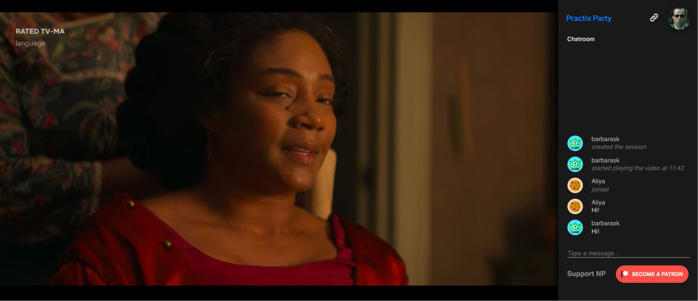

# Проектная работа: диплом

У вас будет один репозиторий на все 4 недели работы над дипломным проектом. 

Если вы выбрали работу в командах, ревью будет организовано как в командных модулях с той лишь разницей, 
что формируете состав команды и назначаете тимлида вы сами, а не команда сопровождения.

Удачи!

Выполните проект «Кино вместе»: кнопка, проверяющая список «Хочу посмотреть» у друзей пользователя и выводящая 
совпадения. 
После чего начинается сеанс совместного просмотра с чатом. Также есть общий механизм управления (пауза, перемотка) 
контентом у всех.

Экраны в клиентском приложении

