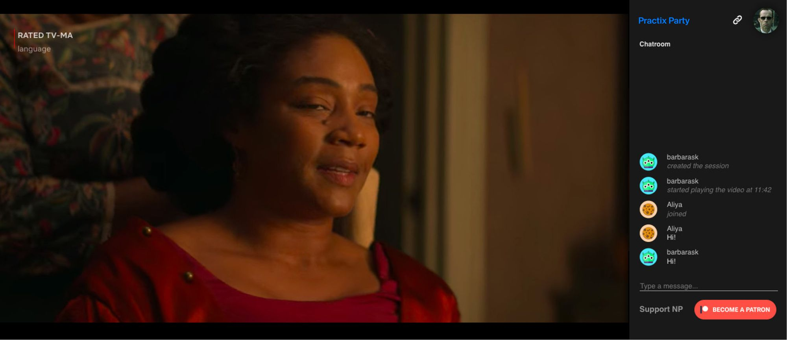
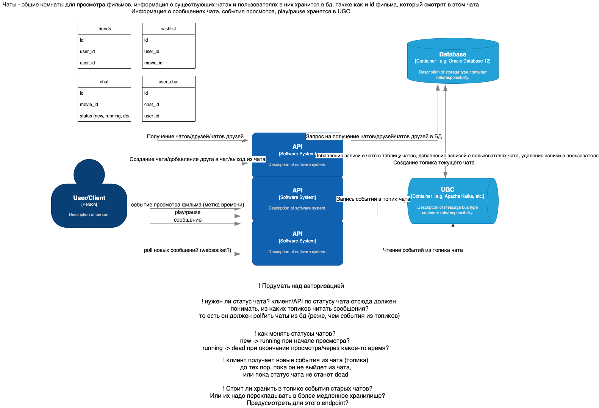

# Description 

Выполните проект «Кино вместе»: кнопка, проверяющая список «Хочу посмотреть» у друзей пользователя и выводящая 
совпадения. 
После чего начинается сеанс совместного просмотра с чатом. Также есть общий механизм управления (пауза, перемотка) 
контентом у всех.

## User story:

1) Василий зашел на сайт.
2) Авторизовался.
3) Попал на страницу с фильмами.
4) Увидел фильм, который давно хотел посмотреть.
5) Нажал кнопку “Хочу посмотреть”.
6) После этого Василий жмет кнопку "Смотреть вместе".
7) Появляется экран просмотра фильма, справа появляется чат.
8) Друзья Василия могут присоединиться к просмотру, войдя в комнату.
9) Все находящиеся в комнате могут управлять просмотром фильма (перемотка, пауза, возобновление просмотра).
10) По завершении просмотра комната удаляется.

## Как это реализовать

1) Юзер жмет кнопку "Хочу посмотреть".
2) Сервис movie together делает запрос в Auth, забирает друзей юзера.
3) Сервис movie together делает запрос в UGC, проверяет совпадения.
4) Сервис movie together создает комнату для просмотра фильма и общения (генерит ID сеанса, создает партицию с ключем - ID сеанса в топике событий watch_together кафка, делает запрос в сервис Chat, создает комнату).

  4.1) Сервис Chat на вебсокетах начинает обмен сообщениями.

  4.2) Видеоплеер, шлет события в UGC в топик  watch_together в партицию комнаты.

  4.3) Сервис movie together вычитывает кафку на предмет отправки действий по управлению плеером и передает их самому 
плееру.

5) Сервис movie together после просмотра "закрывает комнату"
6) Сообщения из чата уходят "на хранение" 

Черновая схема:

## Что необходимо для реализации

1. В настоящий момент у нас нет функционала, для создания связей между юзерами (связанной таблицы друзья). Нет функционала,
показывающего список друзей конкретного юзера.

2. Нет функционала, для того, что бы получить выборку юзеров, лайкнувших конкретный фильм (или есть? надо проверить).

3. В настоящий момент мы только ловим timestamp из mock-сервиса, имитирующего просмотр фильма юзерами. Нужно расширить UGC, 
для обработки событий просмотра в "комнате".

4. Вынести валидацию токена на уровень Gateway (чтобы не делать это в каждом сервисе, нужно проверить имеющиеся модули). 
Соответственно, нужно написать Gateway (проксировать запросы между сервисами, валидировать токены).

5. Написать сервис Movie together.

6. Написать сервис Chat. Причем делать это отдельным сервисом, чтобы иметь возможность изящно деградировать.

7. Написать клиент для демонстрации работы чата и управления видеоплеером.

### Friends table

В Auth сервисе необходимо:
- добавить таблицу со связями follower/following. 
- добавить роуты для добавления/удаления друзей.
- добавить роут, возвращающий друзей.

### UGC friends films

- необходимо подумать, как выгребать понравившиеся фильмы друзей из UGC API.

### UGC movie together logic

- необходимо расширить API: 1) принимать события из "комнаты" и писать их в отдельные партиции одного топика. Причем писать 
timestamp + action; 2) принимать запрос на вычитывание событий из партиции комнаты (ПРЕДЛОЖЕНИЕ: данный запрос на вход может принимать последний вычитанный timestamp и id пользователя, который хочет вычитать (это будет consumer_group_id) - для того, чтобы в кафке можно было читать из одной партиции нескольким пользователям)
- сейчас есть работа только с лайками, нет логики работы с вишлистом, нужно реализовать.

### API Gateway

Данный модуль отсутствует в принципе. Нужно или писать или как-то имитировать деятельность отвечающую за:

- общую точку входа.
- проверку токенов. 
- прокидывание запросов между сервисами.

### Movie together

Нам необходим сервис, который будет:
- Возвращать "Друзья, которые тоже хотят посмотреть этот фильм".
- Принимать событие "Смотреть вместе".
- Создавать "комнату" (партиция в топике в кафке, чатик) с уникальным ID.
- Скорее всего управлять плеером тоже будет этот сервис (обсудить).
- Принимать запрос на чтение событий совместного просмотра из кафки
- Закрывать комнату (наверное тоже он, инициировать перелив данных на долгое хранение).

### Chat

Написать сервис на FastAPI с роутами:
- Создать комнату.
- Получить юзеров в этой комнате.
- Пригласить юзера в комнату.
- Получить комнату.
Написать сервис на вебсокетах для:
- обмена сообщениями между юзерами.

## Questions

- Как управлять плеером?
- Требования к производительности
