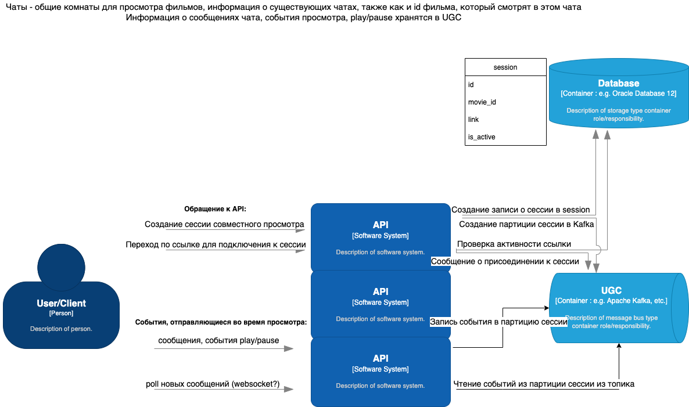

# Description 

>Выполните проект «Кино вместе»: кнопка, проверяющая список «Хочу посмотреть» у друзей пользователя и выводящая 
совпадения. 
После чего начинается сеанс совместного просмотра с чатом. Также есть общий механизм управления (пауза, перемотка) 
контентом у всех.


# Проблематика. 

## Case 1: площадка кино-активистов

Почти у каждого человека есть друг или знакомый, который потребляет много медиа-контента и в курсе того, какой фильм 
стоит посмотреть и даже может объяснить почему именно "тебе" и "именно его". При этом такие люди, как правило, 
активны в своей компании, и их мнение имеет авторитет в компании друзей.

Просто смотри "Кино вместе".

## Case 2: дать людям возможность стать "ближе"

На улице коронавирус? В кинотеатры ходить страшно? Да еще и многие закрылись? Неудобное время сеанса? Нет интересных 
фильмов в прокате? Интроверт? Девушка живет в другом городе? 

Просто смотри "Кино вместе".

## Case 3: поржать с пацанами

Все веселые лица друзей обзавелись семьями и вы ведитесь раз в год? Собирайтесь вместе в нашем кинотеатре, обменивайтесь
смайликами и комментариями в чате.

Просто смотри "Кино вместе".
___

# Ценность (value) 

В зависимости от того, как наш бизнес зарабатывает возможно несколько вариантов использования:
1) на подписках: 
мы можем сделать "семейную подписку (+30% к стоимости основной подписки)" или 
доступ к просмотру сделать только для юзеров с подпиской
2) на рекламе: 
с помощью фичи мы сможем удерживать большее количество одновременно находящихся 
на сайте юзеров, тем самым показать им больше рекламы.
3) на рекламе и на подписках (отключаем рекламу тем, кто оплатил подписку): 
зарабатываем как на п.1, так и на п.2.
___

# Ограничения. 

Мы должны выкатить фичу в течение месяца силами двух зелекопов. В связи с этим мы планируем использовать уже 
существующие сервисы (Auth, UGC, Movie). 

Выкатывать планируем на web-версию, так как для TV и мобильной версии функционал чата не подходит (на TV набирать 
сообщения то еще удовольствие, на мобильной версии мы ограничены размером экрана). 

Если появится запрос от пользователей TV/mobile на этот функционал, будем расширять функцию просмотра, и, возможно, 
голосового чата.
___

# Затраты 

Большая часть реализации - это расширение существующего функционала сервиса UGC. И создание одного сервиса для работы 
чата и совместного управления просмотром фильма.
Мы планируем использовать популярные инструменты (FastAPI, Kafka, Websockets) для решения задачи. Так как инструменты 
популярны, на рынке всегда будут те, кто сможет это поддерживать.
___

# Макеты.

В web-версии мы реализуем нечто подобное на отдельной странице.


Драфт работы чата / видео


___

# Сценарии.

## User story 1:

1) Василий зашел на сайт.
2) Авторизовался.
3) Попал на главную страницу с фильмами.
4) Увидел фильм, который давно хотел посмотреть.
5) Нажал кнопку “Хочу посмотреть”.
6) Появляется страница просмотра фильма, где Василий видит кнопку "Пригласить друзей".
7) Василий жмет на неё.
8) Генерируется ссылка на "комнату просмотра".
9) Василий кидает ссылку Петру в телеграм, при переходе на которую Петр попадет в комнату к Василию.
10) Все находящиеся в комнате могут управлять просмотром фильма (перемотка, пауза, возобновление просмотра).
11) По завершении просмотра комната удаляется.

## User story 2:

1) Петр получает уведомление в телеграм с ссылкой на просмотр фильма
2) Переходит по ссылке
3) Видит экран, где предложено авторизоваться или создать аккаунт
4) Авторизуется
5) Попадает в комнату просмотра фильма, где есть чат, фильм и Василий
6) Может управлять просмотром, писать сообщения
7) При выходе Петра комната не удаляется
___

# Уведомления. 

Пользователи будут самостоятельно обмениваться ссылкой на сеанс просмотра. Дополнительных доработок не требуется.
___

# Технологии

## Новое:
- Для Movie Together API используем ассинхронный фреймворк - FastAPI.
- Для реализации обмена данными между клиентами - Websocket

## Существующее:
- Для хранения данных "на горячую" - Kafka
- Для хранения данных "на холодную" - MongoDB
___

# Детали реализации

1) Юзер жмет кнопку "Хочу посмотреть".
Сервис movie together создает комнату для просмотра фильма и общения (генерит ID сеанса, создает партицию с ключем - 
ID сеанса в топике событий watch_together кафка).
2) Юзер жмет кнопку "Пригласить друзей".
Сервис movie together генерирует ссылку для присоединения к просмотру фильма.
3) Юзер 2 присоединился 
Вебсокеты кастуют магию
4) Юзер 1 нажал на элемент управления плеером
Вебсокеты кастуют магию
5) Сервис movie together после просмотра "закрывает комнату"
что-то происходит с партицией
6) Сообщения из чата уходят "на хранение" 
ETL процесс перекладывает данные в холодную базу

Черновая схема:




## База для хранения данных о комнате (сессии совместного просмотра фильма)

Для хранения данных о комнате: фильм, владелец, количество участников, дата создания и т.д. Мы решили использовать 
Postgres. 

Схема БД выглядит следующим образом:


Есть сущность "Комната", в которой мы храним юзеров, фильм, ссылку на комнату, время создания комнаты, текущий статус 
комнаты, владельца комнаты.

Статус - в настоящий момент мы не решили до конца, что будет происходить с комнатой, если все вышли из неё.
Логично после выхода последнего участника "удалять" комнату. С другой стороны, вдруг кто-то захочет вернуться, чтобы 
почитать переписку, или в конце были важные сообщения, а последнего участника выкинуло.

В ETL процессе можно будет настроить перекладывание данных в "холодную базу" и удаление (деактивацию) комнаты, спустя 
какой-то промежуток времени.


## Movie together API

### Create room

Фронтенд делает запрос на `POST room/`. 

В этот момент в Postgres создается две записи: 
1) сущность комнаты
2) связь юзера (хоста) и комнаты.

API возвращает JSON вида

```json
{
    "success": true,
    "errors": [],
    "link": "https://tinyurl.com/yasq2afr"
}
```

Если возникла ошибка, то API вернёт что-то вроде:

```json
{
    "success": false,
    "errors": [
        "Room for user \"6ad3a14e-2ffd-4e3a-9013-b981a202b159\" already exist!"
    ],
    "link": null
}
```

### Join

`GET room/{room_id}/join`

При переходе по ссылке вида `https://tinyurl.com/yasq2afr` происходит редирект -> `http://0.0.0.0:8000/api/v1/room/7d3f500c-3e18-4c8a-bb23-be621f6db5b9/join`

Если все ОК, в `movie_together_room_user` создается запись о присоединившемся пользователе.

```json
{
    "success": true,
    "errors": []
}
```

При наличии ошибок:

```json
{
    "success": false,
    "errors": [
        "Room user \"84b8afa9-38fd-4369-8147-43f006f484ff\" already exist!"
    ]
}
```

### Disconnect

`POST room/{room_id}/disconnect`

Если все ОК, в `movie_together_room_user` удаляется запись о пользователе.

```json
{
    "success": true,
    "errors": []
}
```

При наличии ошибок:

```json
{
    "success": false,
    "errors": [
        "User \"84b8afa9-38fd-4369-8147-43f006f484ff\" does not exist in the room \"84b8afa9-38fd-4369-8147-43f006f484ff\"!"
    ]
}
```

## Мониторинг

Для мониторинга используем [Sentry](https://sentry.io/)
